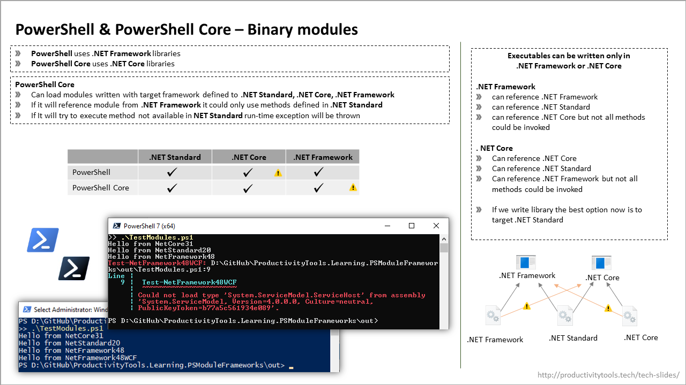

# ProductivityTools.Learning.PSModuleFrameworks

Writing PowerShell binary modules now requires to understood couple concepts:
- Difference between Powershell and Powershell Core
- .NET Framework and .NET Core frameworks
- .NET Standard API

Slide below summarize what I learnt and code helps to understood.

